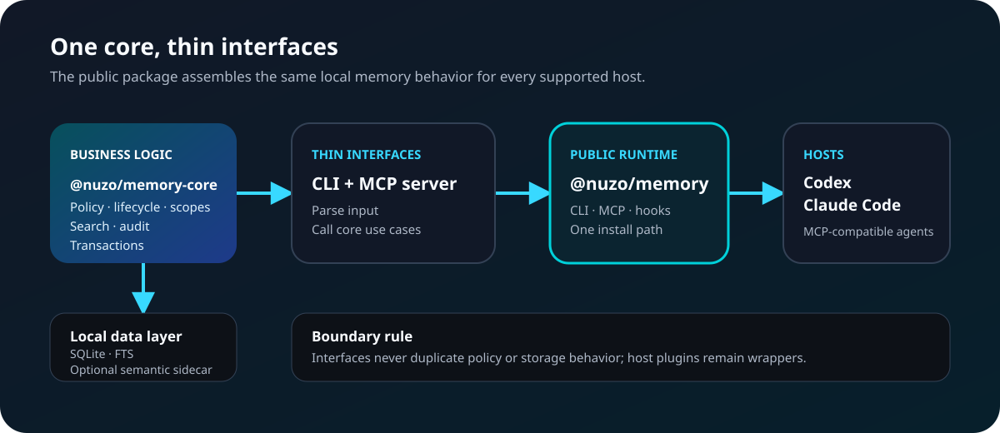

# Architecture Overview

Nuzo is split into a small core and multiple interfaces.

<figure class="nuzo-diagram" tabindex="0" aria-label="Scrollable Nuzo package architecture diagram">
  
  <figcaption>Package direction and ownership boundaries. Arrows show dependency flow, not network calls.</figcaption>
</figure>

The diagram is the package view. The runtime ports inside the core follow this
more detailed shape:

```text
Agent / User
    |
    | MCP tools / CLI commands
    v
Interface Layer
    |
    v
Core Memory Service
    |
    +-- Storage Adapter
    +-- Search Adapter
    +-- Audit Log
    +-- Policy Engine
    +-- Transaction Manager
    |
    v
Local Store
```

## Components

### Core Memory Service

Owns the memory lifecycle:

- validation;
- deduplication;
- scope resolution;
- storage;
- search;
- update;
- deletion;
- audit events.

### Storage Adapter

The MVP storage adapter uses SQLite. The adapter boundary keeps the project open to future storage backends without changing the MCP contract.

### Search Adapter

SQLite FTS remains the canonical, default full-text search adapter. Optional
semantic retrieval uses a core-owned provider boundary and a separate derived
sidecar. Hybrid retrieval fuses bounded FTS and semantic ranks without making
embeddings a requirement for normal use. See
[Optional Semantic Retrieval](../spec/semantic-retrieval.md).

### Transaction Manager

The core groups each logical mutation behind a storage-neutral transaction
port. The SQLite adapter commits memory rows, FTS changes, and audit events
together or rolls them all back.

Stateful writes use optimistic concurrency. Memory rows carry a monotonically
increasing revision, and update/archive/delete operations compare the last read
revision with the row that is committed. A mismatch returns
`MEMORY_REVISION_CONFLICT` so agents can re-read and ask for confirmation
instead of overwriting a newer local change.

### Policy Engine

The policy engine decides whether a memory action is allowed, suggested, blocked, or requires confirmation.

Early policies:

- do not store secrets;
- do not store credentials;
- enforce optional scope allowlists for restricted MCP and host sessions;
- prefer explicit user approval for personal facts;
- block memory writes in disabled scopes;
- warn before destructive deletes.

Scope selectors are not an access-control boundary by themselves. Authorization
belongs in core policy so CLI, MCP, and host plugins share the same behavior.
Interfaces may provide defaults, such as an MCP session allowlist, but they must
not duplicate scope authorization rules.

An unrestricted policy represents a local administrator workflow over one
store. A restricted policy requires explicit scopes and rejects cross-scope
reads, writes, exports, and destructive operations.

### MCP Server

The MCP server exposes memory operations to agents.

It should be thin: parse tool arguments, call the core service, and return structured results.

### CLI

The CLI is the user-facing control plane.

It should support:

- direct memory management;
- diagnostics;
- export/import;
- migrations;
- Git safety checks.

### Host Plugins

Host plugins package the MCP server and defaults so agent hosts can use Nuzo without custom wiring.

Codex and Claude Code are the first host packages. Both support MCP-based extension paths, and both Nuzo packages should stay thin wrappers around the same MCP server.

Host plugins are wrappers. They must not contain memory business logic.

## Package Direction

The intended dependency and publishing direction is:

```text
@nuzo/memory-core
  -> workspace CLI and MCP server
  -> generated @nuzo/memory package
  -> generated Codex and Claude Code host artifacts
```

Library integrations use `@nuzo/memory-core`. Most users install
`@nuzo/memory`, which assembles the CLI, MCP server, and host hook runtime.
Source workspace packages remain private; release tooling creates and validates
the public staging packages.

## Default Flow

1. Agent identifies something potentially worth remembering.
2. Agent asks the user for confirmation or receives explicit user instruction.
3. MCP tool calls `memory.remember`.
4. Core validates and stores the memory.
5. Audit log records the write.
6. Future sessions call `memory.recall` with task context.
7. User can inspect or delete the memory through CLI or MCP.
