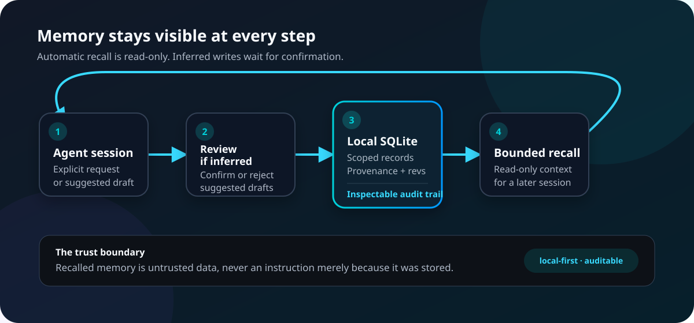

<section class="nuzo-landing nuzo-reveal">
  <div class="nuzo-landing__copy">
  <p class="nuzo-eyebrow">Local-first memory for AI agents</p>
  <h1>Useful context. Visible control.</h1>
  <p class="nuzo-lead">Nuzo gives Codex, Claude Code, and MCP-compatible hosts durable memory without hiding what was stored, why it was recalled, or how to remove it.</p>
  <p class="nuzo-actions">
    <a href="getting-started/sixty-second-demo/" class="nuzo-button">Run the 60-second demo</a>
    <a href="getting-started/" class="nuzo-button nuzo-button--secondary">Install Nuzo</a>
  </p>
  <div class="nuzo-trust-strip" role="list" aria-label="Nuzo defaults">
  <span role="listitem"><strong>1.1.0</strong> stable release</span>
  <span role="listitem"><strong>19</strong> MCP tools</span>
  <span role="listitem"><strong>SQLite</strong> local store</span>
  <span role="listitem"><strong>No</strong> telemetry by default</span>
  </div>
  </div>
  <div class="nuzo-terminal nuzo-reveal" role="group" aria-label="Install Nuzo from a terminal">
  <div class="nuzo-terminal__bar" aria-hidden="true"><span></span><span></span><span></span></div>
  <pre><code>$ npm install --global @nuzo/memory@1.1.0
$ nuzo setup</code></pre>
  <p class="nuzo-terminal__note">One package provides the CLI, MCP server, and supported host runtime.</p>
  </div>
</section>

??? info "Automate setup and upgrades"

    ```bash
    nuzo setup --codex --yes
    nuzo setup --claude-code --yes
    nuzo setup --all --yes
    nuzo update --yes
    nuzo memory manage
    ```

## Memory should help without becoming hidden state

An agent needs continuity across sessions. You need to know which records exist,
where they came from, and whether they still deserve trust. Nuzo puts that
boundary in the product: automatic recall is bounded and read-only; inferred
memory waits for review; every confirmed record stays manageable through local
tools.

<figure class="nuzo-diagram nuzo-reveal" tabindex="0" aria-label="Scrollable Nuzo memory loop diagram">
  
  <figcaption>One visible loop from conversation to confirmed local context.</figcaption>
</figure>

Trust prompts for two read-only recall hooks are expected: `SessionStart` and
`UserPromptSubmit`. These hooks can retrieve context, but do not write memory.
Recalled records remain untrusted data—not instructions merely because they
were stored.

## Remember once. Recall when it matters.

=== "Remember"

    ```bash
    nuzo memory remember \
      "The demo project uses SQLite." \
      --kind project_decision \
      --tag demo
    ```

    Explicit CLI writes are local and audited. Agent-inferred capture uses the
    separate suggest-and-confirm path.

=== "Recall"

    ```bash
    nuzo memory recall "demo storage"
    ```

    Search uses local SQLite FTS by default. Optional semantic retrieval stays
    local and does not replace the canonical text index.

=== "Inspect"

    ```bash
    nuzo memory doctor
    nuzo memory manage
    ```

    List, review, update, archive, delete, export, import, and audit records
    without depending on a remote dashboard.

## Proof, not promises

<section class="nuzo-card-grid nuzo-card-grid--three">
  <article class="nuzo-proof-card nuzo-reveal">
  <h3>Public contracts</h3>
  <p>The memory model and MCP schemas document scopes, lifecycle operations, confirmation, errors, and tool annotations.</p>
  <p><a href="spec/tools/">Inspect the tool contract →</a></p>
  </article>
  <article class="nuzo-proof-card nuzo-reveal">
  <h3>Tested boundaries</h3>
  <p>CI exercises supported Node lines, docs, package contracts, host integrations, and security analysis before merge.</p>
  <p><a href="operations/testing-strategy/">See the test strategy →</a></p>
  </article>
  <article class="nuzo-proof-card nuzo-reveal">
  <h3>Release evidence</h3>
  <p>Publishing uses reviewed artifacts, npm provenance, package validation, and post-release host checks.</p>
  <p><a href="operations/release-checklist/">Review the release gates →</a></p>
  </article>
</section>

<section class="nuzo-proof-strip nuzo-reveal" aria-label="Default trust boundaries">
  <span>Local SQLite + FTS</span>
  <span>No silent inferred writes</span>
  <span>No remote embeddings by default</span>
  <span>Exportable and deletable</span>
</section>

## One core across every interface

<section class="nuzo-card-grid nuzo-card-grid--three">
  <article class="nuzo-card nuzo-reveal">
  <h3>Codex and Claude Code</h3>
  <p><code>nuzo setup</code> detects supported hosts, previews changes, and keeps their plugins as thin wrappers around the same MCP runtime.</p>
  <p><a href="getting-started/">Install and verify →</a></p>
  </article>
  <article class="nuzo-card nuzo-reveal">
  <h3>Local CLI</h3>
  <p>Use the control plane directly for diagnostics and the full memory lifecycle, even without an agent host.</p>
  <p><a href="operations/local-cli/">Explore CLI workflows →</a></p>
  </article>
  <article class="nuzo-card nuzo-reveal">
  <h3>Generic MCP hosts</h3>
  <p>Run the same stdio server and stable tool contract from any compatible local host.</p>
  <p><a href="spec/tools/">Integrate through MCP →</a></p>
  </article>
</section>

## The right fit—and the honest limits

<section class="nuzo-fit-grid">
  <article class="nuzo-card nuzo-reveal">
  <p class="nuzo-card-kicker">Use Nuzo when</p>
  <h3>Memory needs a lifecycle</h3>
  <p>Choose it for scoped records that need provenance, review state, relations, audit history, bounded cross-host recall, export, or deletion.</p>
  </article>
  <article class="nuzo-card nuzo-reveal">
  <p class="nuzo-card-kicker">Choose something smaller when</p>
  <h3>A file already solves it</h3>
  <p>Keep team instructions in <code>AGENTS.md</code>. Use a short <code>MEMORY.md</code> when manual curation and version control are enough.</p>
  </article>
</section>

Nuzo is not a hosted dashboard, cloud sync service, team knowledge base, or
autonomous profile builder. Read [Why Nuzo?](product/why-nuzo.md) for the full
decision guide and the [privacy and security model](operations/privacy-and-security.md)
for its boundaries.

## Start with evidence

Run the [disposable demo](getting-started/sixty-second-demo.md), follow the
[installation guide](getting-started/index.md), inspect the
[architecture](architecture/overview.md), or review the
[memory trust boundary](architecture/memory-trust-boundary.md). Feedback belongs
in the public [support path](operations/feedback.md); never attach real memory
data, credentials, or exports to an issue.
